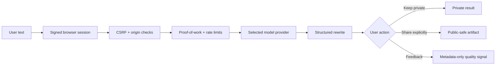
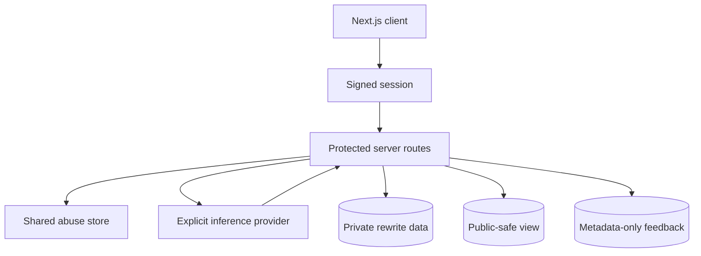

# Second Voice
**A privacy-conscious rewrite product with explicit model routing, abuse protection, opt-in public sharing, and a production-oriented security boundary.**


Second Voice is built around a deceptively hard product problem: rewriting text feels simple until the application has to protect user content, prevent abuse, handle multiple model providers, support sharing, and remain observable without logging the text itself.

## Product flow



## Security architecture



### Explicit provider routing

The server chooses the configured provider intentionally. It does not silently hop between model vendors when one fails, which keeps cost, behavior, and data routing inspectable.

### Public sharing is opt-in

A rewrite is not public merely because a share feature exists. Public visibility requires an explicit user action and server-side allowance.

### Public readers never query the base table directly

Shared pages read through a constrained public view. Source text is masked by default and only exposed when an explicit source-visibility decision exists.

### Abuse state is durable

Production rate limiting and challenge replay protection use a shared Supabase-backed store rather than per-instance memory.

### Observability without content logging

Quality telemetry records request-scoped metadata such as provider/model, latency, schema/fallback behavior and feedback outcomes without logging prompt or rewrite text.

## Stack

- Next.js 16
- React 19
- TypeScript
- Tailwind CSS
- Framer Motion
- Zod
- Supabase
- server-side model providers

## Protected request path

Representative server surfaces:

```text
/api/ghostwriter/challenge
/api/ghostwriter
/api/ghostwriter/lab
/api/ghostwriter/share
/api/ghostwriter/feedback
```

State-changing/model routes enforce same-origin checks, CSRF, signed sessions, proof-of-work, layered rate limits, and replay protection.

## Data model principles

```text
private rewrite
    ├── source text
    ├── rewritten output
    └── private metadata

explicit share
    ↓
public-safe view
    ├── rewritten output
    ├── safe provenance
    └── source hidden by default

feedback
    ├── request id
    ├── rating / reason
    ├── provider metadata
    └── rewrite hash
        (no source or rewritten text)
```

## Verification

```bash
npm run security:check
npm run test:release:gate
npm run test:security
npm run test:scroll
npx tsc --noEmit
npm run lint
npm run build
```

## Run locally

```bash
git clone https://github.com/miguelalmeida0/second-voice.git
cd second-voice
npm install
npm run dev
```

Copy the example environment and configure only the providers/services you intend to use. Never commit provider keys or Supabase service-role credentials.

## What this project demonstrates

- secure browser → server inference design;
- explicit AI provider routing;
- durable abuse prevention;
- privacy-preserving public artifacts;
- schema-validated model outputs;
- product analytics without storing user content;
- migration discipline around public/private data boundaries.

---

Built by [Miguel Almeida](https://github.com/miguelalmeida0).


[Repository guide](./docs/START_HERE.md)

<!-- repository-presentation-repair:1 -->
